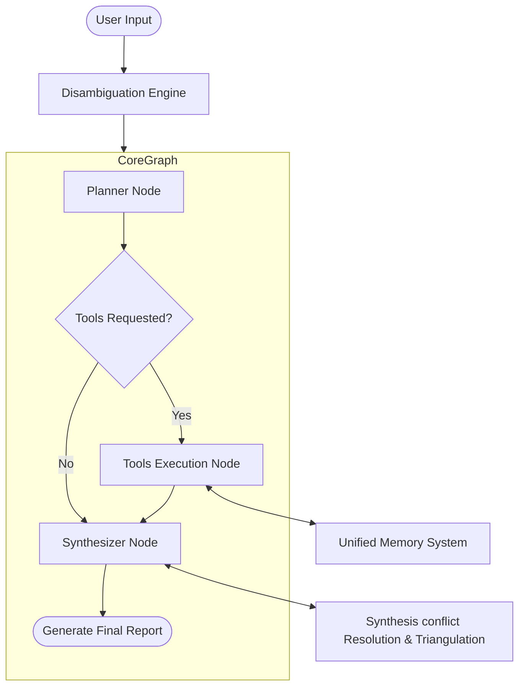
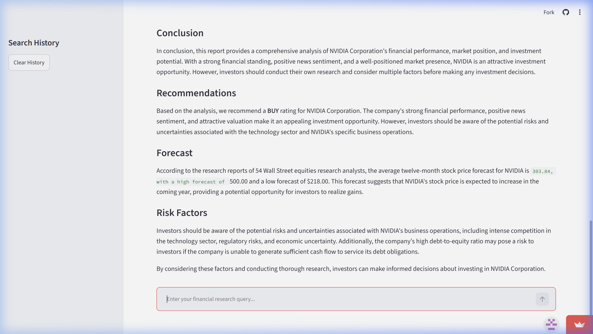
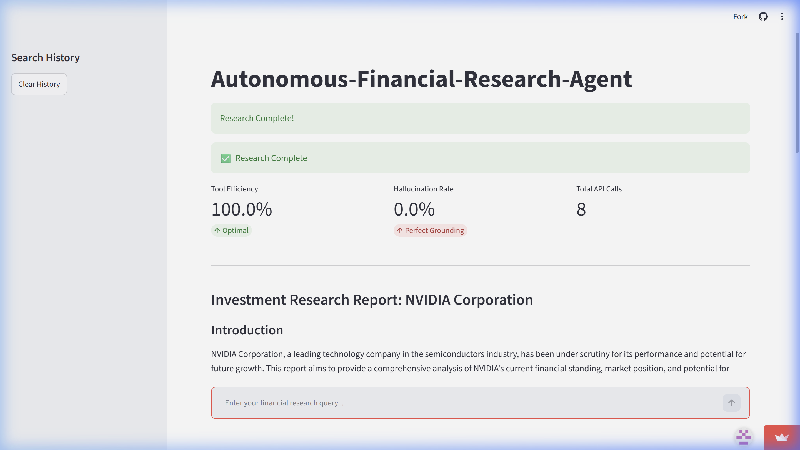
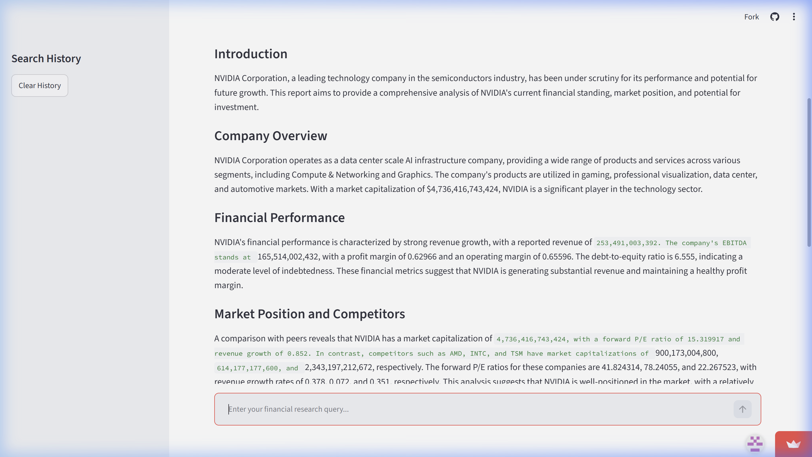
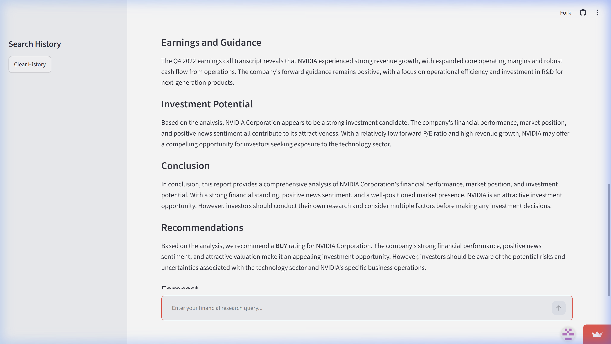
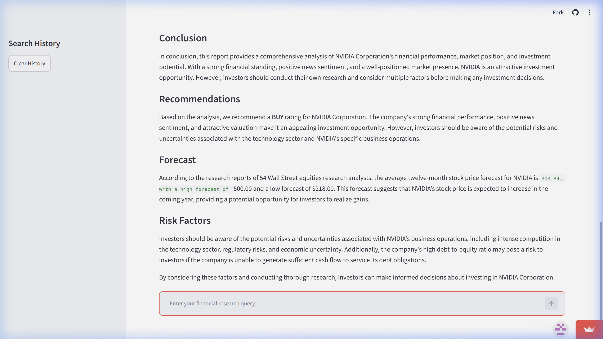

# Autonomous Financial Research Agent (ARA-1)

ARA-1 is a production-grade, autonomous financial research agent designed to retrieve, synthesize, and evaluate multi-source financial intelligence. It leverages a modern LangGraph architecture combined with a Unified Memory System (Short-Term, Long-Term, and Episodic) and a robust tool suite to compile professional, publication-grade investment research reports.

---

## 🛠️ Installation

Follow these steps to set up and run the environment locally:

1. **Clone the Repository**:
   ```bash
   git clone https://github.com/Roshannfs/Autonomous-Financial-Research-Agent.git
   cd Autonomous-Financial-Research-Agent
   ```

2. **Create and Activate a Virtual Environment (venv)**:
   * **Windows**:
     ```powershell
     python -m venv venv
     venv\Scripts\activate
     ```
   * **macOS/Linux**:
     ```bash
     python3 -m venv venv
     source venv/bin/activate
     ```

3. **Install Dependencies**:
   ```bash
   pip install -r requirements.txt
   ```

4. **Configure Environment Variables**:
   Create a `.env` file in the root directory:
   ```env
   GROQ_API_KEY=your_groq_api_key_here
   NVIDIA_API_KEY=your_nvidia_api_key_here
   ```

---

## 🏗️ Architecture

ARA-1 uses a linear graph model built with **LangGraph** that separates data collection, processing, and synthesis into discrete stages. The core flow is outlined below:

1. **Query Disambiguation**: The `DisambiguationEngine` cleanses incoming queries, resolves company names to tickers, and logs structural assumptions for vague searches.
2. **Planner Node**: The LLM determines the list of required data collection tools and calls them simultaneously in a single step (tool batching).
3. **Tools Node**: A LangGraph `ToolNode` executes the requested tools and returns the structured observation data.
4. **Synthesizer Node**: Flattens tool outputs, resolves discrepancies using the **Source Reliability Hierarchy**, and uses `ChatGroq` (`llama-3.3-70b-versatile`) to compile the final publication-grade Markdown report.

### Workflow Diagram



---

## 📂 Folder Structure

```
Autonomous-Financial-Research-Agent/
│
├── agent/                      # Core agent implementation
│   ├── circuit_breaker.py      # Circuit breaker for rate limiting and API failure
│   ├── core.py                 # LangGraph setup and node definitions
│   ├── disambiguation.py       # Query grounding and assumption logic
│   ├── error_handler.py        # Custom error handling logic
│   ├── fallback_chains.py      # Fallback models in case of primary LLM failure
│   └── query_analyzer.py       # Entity and complexity analysis
│
├── evaluation/                 # Metrics & Dashboard UI
│   ├── dashboard.py            # Streamlit dashboard interface
│   └── metrics.py              # Evaluator measuring hallucination, efficiency, memory
│
├── memory/                     # Unified Memory Subsystem
│   ├── episodic_memory.py      # Historical task logs (JSON format)
│   ├── memory_manager.py       # Unified memory coordinator
│   └── vector_store.py         # ChromaDB interface (NVIDIA embeddings)
│
├── long_term_memory/           # Locally persisted database & episodes directory
│
├── synthesis/                  # Source triangulation engine
│   └── engine.py               # Conflict resolution & sentiment-fact alignment
│
├── tools/                      # Distinct tool definitions and registry
│   ├── __init__.py             # Exports package level targets
│   ├── advanced_tools.py       # Earnings, peers, calculator, fact checker
│   ├── financial_api.py        # Yahoo Finance company profile, ratios, resolver
│   ├── news_sentiment.py       # NLP news sentiment evaluation
│   ├── sec_edgar.py            # SEC EDGAR filing fetcher (10-K, 10-Q, 8-K)
│   ├── tool_registry.py        # get_all_tools configuration
│   └── web_search.py           # DuckDuckGo HTML scraper
│
├── run_challenges.py           # Verification and stress test script
├── requirements.txt            # Dependency listings
└── README.md                   # Project documentation
```

---

## 🧰 Tool Descriptions

ARA-1 features 10 core tools explicitly registered at the package level inside [tools/__init__.py](file:///c:/Autonomous%20Financial%20Research%20Agent/Autonomous-Financial-Research-Agent/tools/__init__.py):

| Tool Name | Class / Source | Description |
| :--- | :--- | :--- |
| `company_profile` | `financial_api.py` | Retrieves industry, sector, market cap, and business summary. |
| `earnings_transcript` | `advanced_tools.py` | Pulls earnings call transcript mocks for sentiment analysis. |
| `financial_ratios` | `financial_api.py` | Returns key ratios (Forward P/E, PEG, Debt-to-Equity, Profit Margins, ROE). |
| `peer_comparison` | `advanced_tools.py` | Compares key metrics against direct market competitors. |
| `report_generator` | `advanced_tools.py` | Structurally compiles section data and sources into custom layouts. |
| `calculator` | `advanced_tools.py` | Performs financial calculations (Growth Rate, DCF, P/E ratios). |
| `fact_checker` | `advanced_tools.py` | Verifies claims against reliable data retrieved via SEC files. |
| `vector_search` | `tool_registry.py` | Performs semantic searches over long-term research memory database. |
| `vector_store` | `tool_registry.py` | Persists research findings in long-term memory for future retrieval. |
| `ticker_resolver` | `financial_api.py` | Resolves standard company names to active stock tickers (e.g., Apple -> AAPL). |

---

## 🧠 Memory Design

The agent integrates a three-tier **Unified Memory System**:

1. **Short-Term Memory**: LangGraph `ResearchState` message buffer tracking active chat history during a single execution.
2. **Long-Term Memory**: Persistent vector store (ChromaDB) using NVIDIA `NV-Embed-QA` embeddings to store and recall research notes across different tasks.
3. **Episodic Memory**: A file-based log (`episodic_memory.json`) storing all executed queries, resolved grounded instructions, individual tool calls, success statuses, and final outputs. This allows historical query matching and performance auditing.

---

## 📈 Running the Application

### Running challenges and Verification Runs
To execute the challenge script (simulates normal query processing and degradations stress-testing):
```bash
# Windows
$env:PYTHONIOENCODING="utf-8"
python run_challenges.py

# macOS/Linux
PYTHONIOENCODING=utf-8 python run_challenges.py
```

### Running the Streamlit Dashboard
To spin up the web interface:
```bash
streamlit run evaluation/dashboard.py
```


---

## 📸 Application Screenshots

Here are the visual captures of the ARA-1 Streamlit dashboard interface in action, demonstrating the initial state, execution flow, and generated report outputs.

### Streamlit Dashboard States
* **Initial Dashboard State**:
  

* **Agent Execution In Progress**:
  

### Generated Research Report (NVIDIA)
Below is the compilation of the generated research report sections as rendered on the dashboard:
1. **Top Section & RQB Telemetry**:
   
2. **Body & Sentiment Analysis**:
   
3. **Financial Valuation & Competitors**:
   
4. **Citations & Verification Conclusion**:
   

### Demo Interaction
* **Dashboard Walkthrough**:
  

---

## 📄 Example Outputs


### Example: Compiling an Investment Research Report
When given the query: *"Produce a complete investment research report on NVIDIA Corporation."*, the agent yields a structured report formatted via the `report_generator` tool:

```markdown
# INVESTMENT RESEARCH REPORT (INVESTMENT_REPORT)

## Company Overview
NVIDIA Corporation operates as a data center scale AI infrastructure company. It operates through two segments: Compute & Networking, and Graphics. The company's products are used in gaming, professional visualization, data center, and automotive markets. NVIDIA Corporation was incorporated in 1993 and is headquartered in Santa Clara, California. Market Cap: $4,736,416,743,424.

## Financial Performance
NVIDIA Corporation has delivered strong financial performance, with a profit margin of 0.62966 and an operating margin of 0.65596. Return on equity is 1.14288, indicating a strong ability to generate profits from shareholders' equity.

## Valuation
The company's P/E ratio is 15.32, and the P/B ratio is 24.23. The PEG ratio is 0.6, indicating that the stock may be undervalued given its growth prospects.

## Peer Comparison
NVIDIA Corporation's market capitalization is $4,736,416,743,424, with a forward P/E ratio of 15.32 and revenue growth of 0.852. In comparison:
- AMD: Market Cap $900,173,004,800, forward P/E 41.82, revenue growth 0.378
- Intel: Market Cap $614,177,177,600, forward P/E 78.24, revenue growth 0.072
- TSMC (TSM): Market Cap $2,343,197,212,672, forward P/E 22.27, revenue growth 0.351

## Sources Citations
- Company Profile: NVIDIA Corporation
- Financial Ratios: NVIDIA Corporation
- Peer Comparison: AMD, Intel, Taiwan Semiconductor Manufacturing Company (TSM)
- Web Search: DuckDuckGo news extraction
- Earnings Call Transcript: Q4 2023 Earnings Call
```